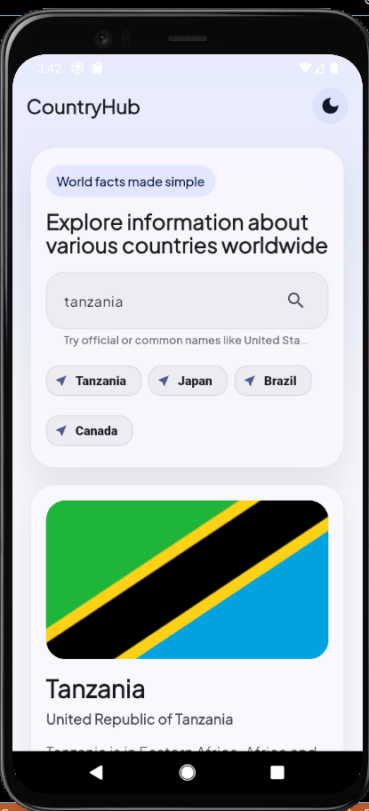
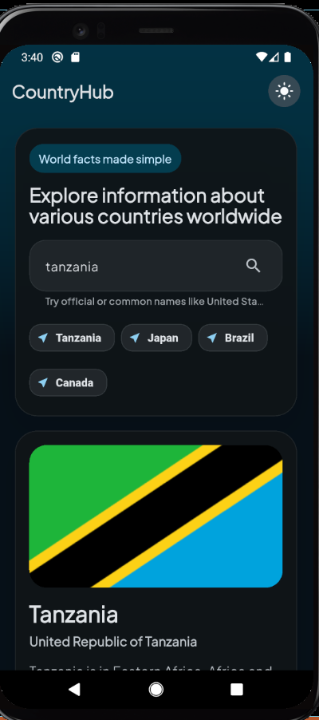
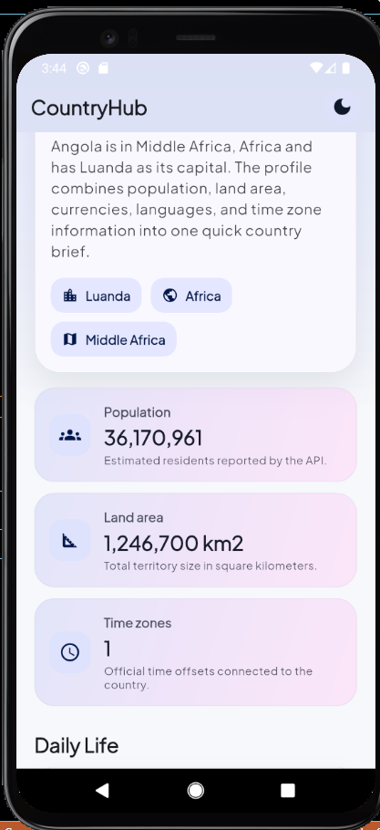
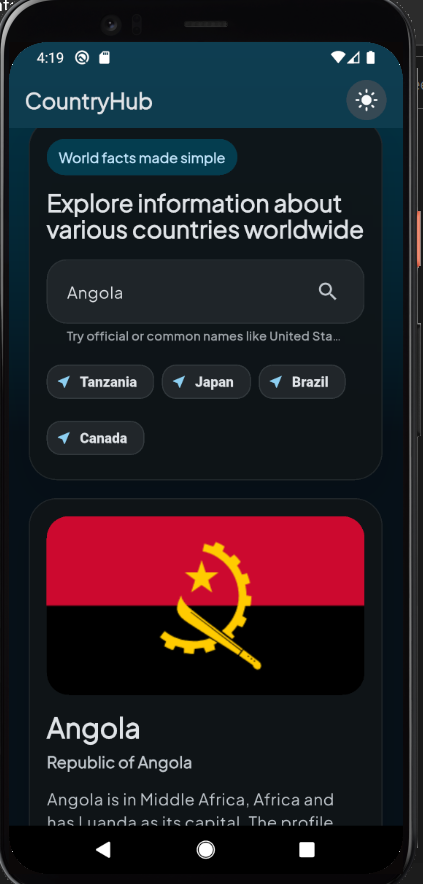

# CountryHub

CountryHub is a Flutter mobile application that allows users to search and explore information about countries around the world by simply entering the country name.

The application uses REST APIs to fetch real-time country data and provides a clean, modern, and responsive user interface with support for both Light Mode and Dark Mode.

---

## Features

- Search countries by name
- View detailed country information
- Light and Dark theme support
- Fast and responsive UI
- REST API integration
- Cross-platform support (Android & iOS)

---

## Technologies Used

- Flutter
- Dart
- REST API

---

## Screenshots

### Example 1

| Light Mode | Dark Mode |
|-------------|-----------------|
|  |  |

### Example 2

| Light mode | Dark mode |
|-------------|----------------|
|  |  |


---

## Getting Started

Clone the repository:

```bash
git clone https://github.com/lusajo321/countryhub.git
```

Navigate to the project directory:

```bash
cd countryhub
```

Install dependencies:

```bash
flutter pub get
```

Run the application:

```bash
flutter run
```

---

## API

This application uses a public REST API to fetch country information in real-time.

---

## License

This project is open-source and available under the MIT License.
